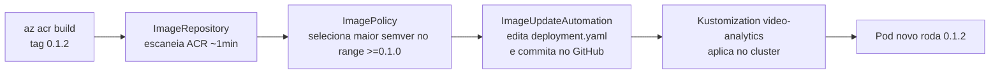

# Fluxo de Atualização Automática de Imagem (Flux GitOps)

Este documento descreve como uma nova versão da aplicação `video-analytics`
chega automaticamente ao cluster edge, sem necessidade de `kubectl set image` manual.

## Visão Geral

Quando você builda uma tag semver nova (ex.: `0.1.2`), o Flux detecta, atualiza o
`deployment.yaml` no GitHub e aplica a mudança no cluster — tudo automaticamente.



## Etapas

1. **`az acr build` (tag 0.1.2)** — Build da imagem com tag semver incremental, enviada ao ACR.
2. **ImageRepository** — Escaneia o repositório do ACR periodicamente (~1 min) e lista as tags disponíveis.
3. **ImagePolicy** — Seleciona a maior versão semver dentro do range configurado (`>=0.1.0`). A tag `latest` é ignorada por não ser semver.
4. **ImageUpdateAutomation** — Edita o `deployment.yaml` com a nova tag e commita a alteração no GitHub.
5. **Kustomization `video-analytics`** — Reconcilia o estado do Git e aplica a mudança no cluster.
6. **Pod novo** — O Kubernetes faz o rollout e o pod passa a rodar a versão `0.1.2`.

## Componentes Relacionados

- Marcador no `edge/k8s/video-analytics/deployment.yaml`: `# {"$imagepolicy": "flux-system:video-analytics"}`
- Range semver em `gitops/clusters/edge-cluster/image-policy.yaml`: `range: ">=0.1.0"`
- `gitops/clusters/edge-cluster/image-repository.yaml`
- `gitops/clusters/edge-cluster/image-update-automation.yaml`

## Fluxo Recorrente

Depois que o Flux está saudável, basta **buildar com uma tag semver nova**
(`0.1.1`, `0.1.2`, …). O Flux cuida do resto.

> **Importante:** toda nova versão precisa de uma tag semver incremental.
> A tag `latest` sozinha é ignorada pelo ImagePolicy, e o pod não atualiza.

## Forçar o Ciclo Manualmente

Para acelerar sem esperar os intervalos de reconciliação:

```bash
flux reconcile image repository video-analytics -n flux-system
flux reconcile image update video-analytics -n flux-system
flux reconcile kustomization video-analytics -n flux-system
```

## Atualização Manual (Troubleshooting)

Use apenas para validação imediata ou quando o Flux não está saudável:

```bash
export KUBECONFIG=/etc/rancher/k3s/k3s.yaml

kubectl set image deployment/video-analytics \
  -n video-analytics \
  video-analytics=aiotdemoacr.azurecr.io/video-analytics:0.1.2

kubectl rollout status deployment/video-analytics -n video-analytics --timeout=120s
```
